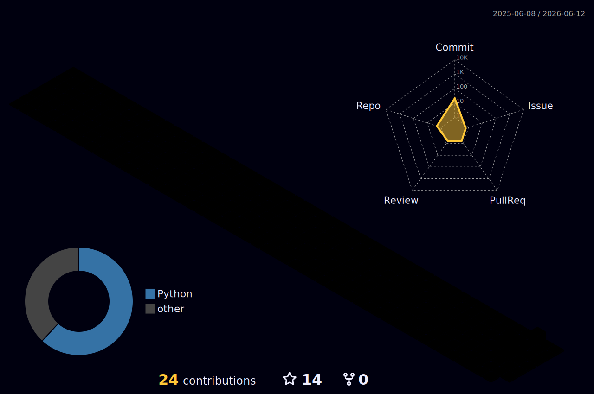

  

  

    
    
    
  

  

    
    
    
    
  

---

## About Me

I am a Ph.D. candidate at **Huazhong University of Science and Technology**, advised by **Prof. Yihua Tan**. My research focuses on **multi-agent reinforcement learning**, especially knowledge routing, parameter sharing, representation disentanglement, and quality-diversity learning for cooperative decision-making.

Before my doctoral research, I worked on wearable-sensor-based monitoring for Parkinson's symptom fluctuations, combining signal processing and deep learning for clinical motion assessment.

## Profile Snapshot

<table>
  <tr>
    <td align="center" width="33%">
      
       
      <strong>Fu Hu / 伏虎</strong>
       
      Intelligent Science and Technology
    </td>
    <td align="center" width="33%">
      
       
      <strong>Huazhong University of Science and Technology</strong>
       
      Wuhan, China
    </td>
    <td align="center" width="33%">
      
       
      <strong>Open to academic collaboration</strong>
       
      MARL · Simulation · Embodied AI
    </td>
  </tr>
</table>

<table>
  <tr>
    <td align="center">
      <strong>Multi-Agent Reinforcement Learning</strong>
       
      Cooperative policy learning, credit assignment, and agent specialization.
    </td>
    <td align="center">
      <strong>Knowledge Routing and Parameter Sharing</strong>
       
      Reducing destructive interference while sharing useful decision knowledge.
    </td>
  </tr>
  <tr>
    <td align="center">
      <strong>Contrastive Representation Learning</strong>
       
      Disentangling local observations into cleaner attribute-aware features.
    </td>
    <td align="center">
      <strong>Robot and UAV Simulation</strong>
       
      Unity, ROS, Isaac Sim, OpenCV, and sim-to-real research workflows.
    </td>
  </tr>
</table>

## Research Highlights

| Area | What I care about |
| --- | --- |
| Multi-Agent RL | Cooperative policy learning, credit assignment, agent specialization |
| Representation Learning | Attribute disentanglement, contrastive objectives, low-noise features |
| Knowledge Sharing | Efficient parameter sharing, routing useful knowledge, reducing conflict |
| Simulation Systems | Unity, ROS, Isaac Sim, UAV platforms, sim-to-real workflows |

## Selected Publications

| Year | Paper | Venue / Status |
| --- | --- | --- |
| Recent | **Tailoring knowledge for empowered cooperative actions in multi-agent reinforcement learning** | *Neural Networks*, CCF B, First Author |
| Recent | **ACM: Multiple Attributes Contrastive Mechanism for Value Decomposition in Multi-Agent Reinforcement Learning** | *ICASSP*, CCF B, First Author |
| Under Review | **SC2: Boosting Cooperation with Shared-Combinatorial and Complementary Representation in Multi-Agent Reinforcement Learning** | Submitted to *IEEE TNNLS*, First Author |
| Under Review | **HPS: Hyperspherical Parameter Sharing for Efficient Multi-Agent Reinforcement Learning** | Submitted to *ICML*, First Author |
| Recent | **Quality-Diversity for Multi-Agent Reinforcement Learning** | *AAMAS*, CCF B |
| Recent | **A Seasonal-Trend-Decomposition-Based Voltage-Source-Inverter Open-Circuit Fault Diagnosis Method** | *IEEE Transactions on Power Electronics*, CAS Q1 Top |

## Projects

| Project | Keywords | Role |
| --- | --- | --- |
| Parkinson's Symptom Fluctuation Monitoring | Wearable sensing, signal processing, temporal neural networks | Major contributor |
| Multi-UAV Cooperative Search Platform | Unity, PX4, OpenCV, MARL, sim-to-real | Major contributor |
| MARL-Based Game System | Multi-agent decision-making, policy coordination | Major contributor |
| RL Obstacle Avoidance for Underwater Vehicles | Deep RL, robust control, ocean disturbance simulation | Major contributor |

## Tech Stack

  
  
  
  
  
  
  
  

## GitHub Stats

  
  

  

  

## GitHub Trophies

  

## Contribution Snake

<picture>
  <source media="(prefers-color-scheme: dark)" srcset="https://raw.githubusercontent.com/stimulus1594/stimulus1594/output/github-contribution-grid-snake-dark.svg" />
  <source media="(prefers-color-scheme: light)" srcset="https://raw.githubusercontent.com/stimulus1594/stimulus1594/output/github-contribution-grid-snake.svg" />
  
</picture>

## 3D Contribution Graph

  

## Honors

- Second Prize, Global Undergraduate Mathematical Contest in Modeling, 2019
- First Prize, Huachuang Cup National Science and Technology Competition, 2019
- Special Prize, Challenge Cup Listed Challenge, 19th edition
- Multiple academic scholarships at HUST and NPU

---

  Generated from my resume and GitHub Profile README beautification workflow.

